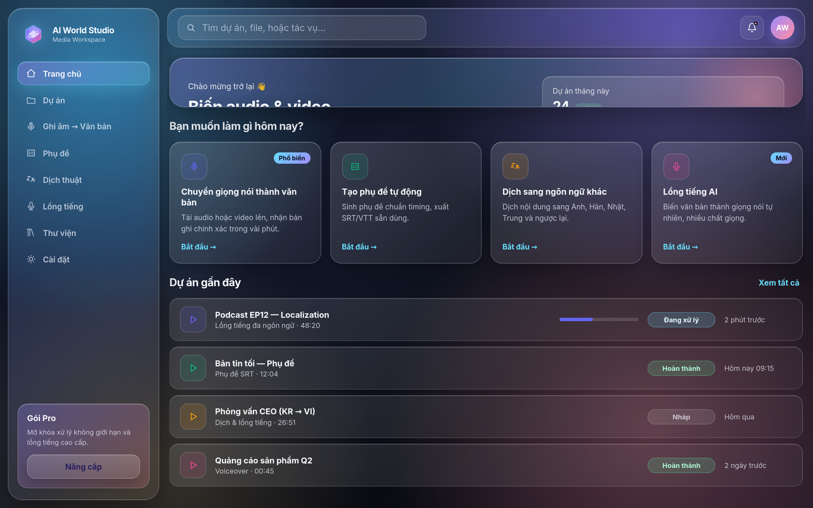
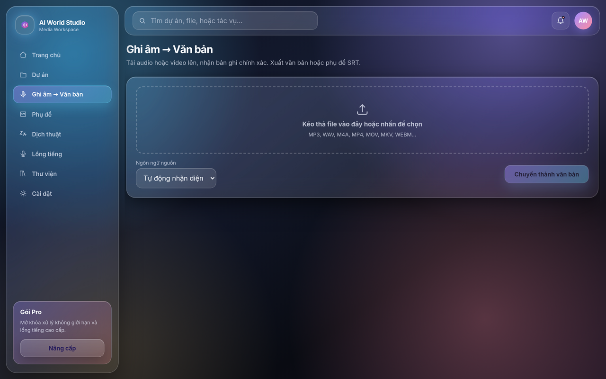
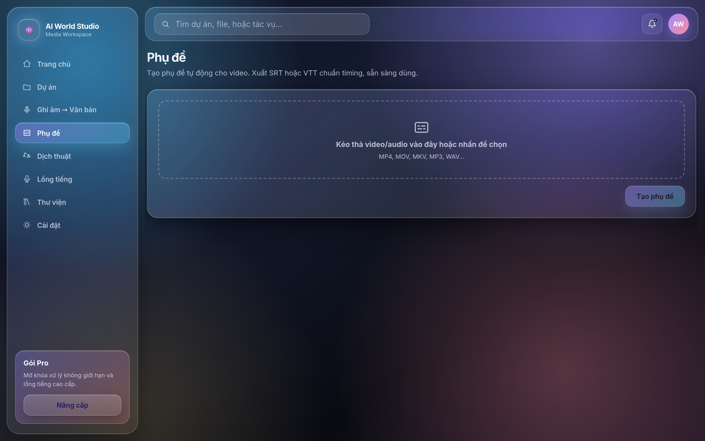
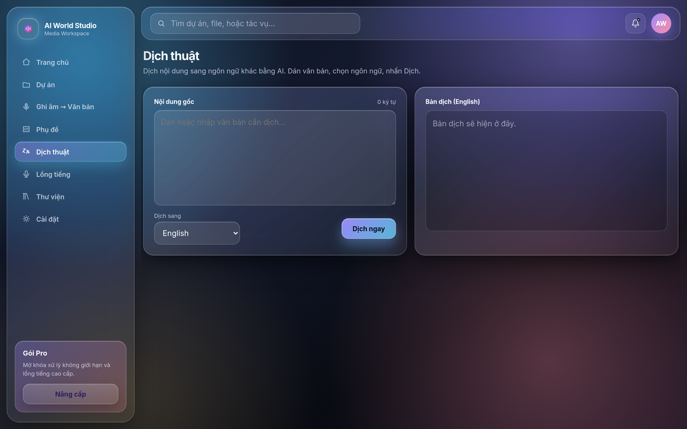
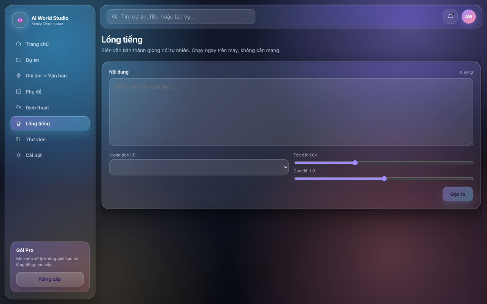
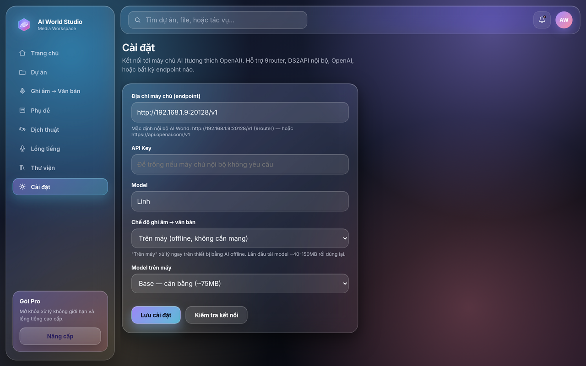

<p align="center">
  
</p>

# AI World Studio



**AI World Studio** là ứng dụng desktop hợp nhất để biến audio/video thô thành **văn bản, phụ đề, bản dịch và giọng nói lồng tiếng** trong một giao diện duy nhất — không phải ghép nhiều công cụ thủ công.

Phiên bản hiện tại: `v0.1.0`.

Ứng dụng đóng gói native cho **macOS, Windows, Linux** qua Tauri (gói nhẹ, không phải Electron).

## Vì sao hữu ích

Quy trình xử lý media bằng AI thường vỡ ở những điểm dễ đoán:

- phải nhảy qua lại giữa nhiều web tool, mỗi tool một tài khoản
- file audio/video phải upload lên dịch vụ ngoài, lo ngại quyền riêng tư
- bản ghi, phụ đề, bản dịch nằm rải rác, khó gom thành output dùng được
- phụ thuộc mạng và API trả phí cho cả những việc máy local làm được

AI World Studio gom các bước đó vào một workspace, ưu tiên xử lý **trên máy (local-first)** và chỉ gọi API online khi bạn chủ động bật.

## Triết lý sản phẩm

- **Local-first, online tùy chọn** — Ghi âm/Phụ đề/Lồng tiếng chạy offline ngay trên máy; Dịch thuật và ASR online qua endpoint cấu hình được.
- **Cài đâu cũng tự chạy** — không hardcode máy chủ; lần đầu mở app tự cấu hình endpoint qua Settings.
- **Thiết kế operator-first** — UI dark glassmorphism, aurora background, accent tím–cyan, đọc rõ trong môi trường làm việc lâu.
- **Đóng gói desktop** — một file cài đặt cho mỗi hệ điều hành, không cần dựng server.

## Các chức năng chính

### 1. Ghi âm → Văn bản (Transcription)

Tải audio/video lên, nhận bản ghi chính xác kèm ngôn ngữ và thời lượng. Xuất `.txt` hoặc `.srt`.

- chạy **trên máy (offline)** bằng Whisper WASM (transformers.js) — mặc định, không cần mạng
- hoặc gọi **máy chủ ASR online** khi cần model mạnh hơn
- tự nhận diện ngôn ngữ, hoặc chọn Việt / English / 한국어 / 日本語 / 中文



### 2. Phụ đề (Subtitle)

Sinh phụ đề chuẩn timing cho video. Xuất `.srt` hoặc `.vtt` sẵn sàng dùng.

- mỗi dòng phụ đề có mốc thời gian rõ ràng
- dùng chung engine ASR với chức năng Ghi âm (local hoặc API)



### 3. Dịch thuật (Translation)

Dán văn bản, chọn ngôn ngữ đích, nhấn Dịch. Bản dịch hiển thị song song với bản gốc, có nút sao chép.

- dịch qua máy chủ AI tương thích OpenAI (9router nội bộ, OpenAI, hoặc endpoint bất kỳ)
- hỗ trợ nhiều cặp ngôn ngữ (Việt ↔ Anh / Hàn / Nhật / Trung)



### 4. Lồng tiếng (Voice / TTS)

Biến văn bản thành giọng nói tự nhiên. Chạy **offline 100%** bằng Web Speech của hệ điều hành.

- chọn giọng đọc, điều chỉnh tốc độ (speed) và cao độ (pitch)
- không gửi dữ liệu ra ngoài



### 5. Cài đặt máy chủ AI (Settings)

Kết nối tới bất kỳ máy chủ AI tương thích OpenAI và chọn chế độ xử lý.

- endpoint + API key + model (mặc định nội bộ AI World: `http://192.168.1.9:20128/v1`)
- chế độ ASR: **Trên máy (offline)** hoặc **Máy chủ API (online)**
- chọn model offline: Tiny (~40MB) / Base (~75MB) / Small (~250MB)
- nút **Kiểm tra kết nối** xác nhận endpoint hoạt động trước khi dùng



## Bắt đầu nhanh — Hướng dẫn từng bước

### Bước 1 — Cài đặt ứng dụng

Tải gói cài đặt cho hệ điều hành của bạn từ trang [Releases](https://github.com/adamwang99/aiworld-studio/releases):

| Hệ điều hành | File cài đặt |
|---|---|
| Linux (Debian/Ubuntu) | `AIWorldStudio_0.1.0_amd64.deb` |
| Linux (Fedora/RHEL) | `AIWorldStudio_0.1.0_x86_64.rpm` |
| Linux (portable) | `AIWorldStudio_0.1.0_amd64.AppImage` |
| macOS (Apple Silicon) | `AIWorldStudio_0.1.0_aarch64.dmg` |
| macOS (Intel) | `AIWorldStudio_0.1.0_x64_intel.dmg` |
| Windows (installer) | `AIWorldStudio_0.1.0_x64-setup.exe` |
| Windows (MSI) | `AIWorldStudio_0.1.0_x64_en-US.msi` |

Linux Debian/Ubuntu:

```bash
sudo apt install ./AIWorldStudio_0.1.0_amd64.deb
```

### Bước 2 — Mở app và vào Cài đặt

Mở **AI World Studio**, nhấn **Cài đặt máy chủ AI** ở màn hình chính (hoặc mục **Cài đặt** ở sidebar).


### Bước 3 — Kết nối máy chủ AI

Tại trang **Cài đặt**:

1. Nhập **Địa chỉ máy chủ (endpoint)** — ví dụ `http://192.168.1.9:20128/v1` (9router nội bộ) hoặc `https://api.openai.com/v1`.
2. Nhập **API Key** nếu máy chủ yêu cầu (để trống nếu nội bộ không cần).
3. Nhập **Model** — ví dụ `Linh` hoặc `gpt-4o-mini`.
4. Chọn **Chế độ ghi âm → văn bản**: *Trên máy (offline)* để xử lý ngay trên thiết bị, hoặc *Máy chủ API* để dùng online.
5. Nhấn **Lưu cài đặt**, rồi **Kiểm tra kết nối** để xác nhận.


### Bước 4 — Chạy chức năng đầu tiên

Quay lại sidebar và chọn chức năng:

- **Ghi âm → Văn bản**: kéo-thả file audio/video, chọn ngôn ngữ nguồn, nhấn xử lý, tải kết quả `.txt`/`.srt`.

  

- **Phụ đề**: tải video lên, sinh phụ đề chuẩn timing, tải `.srt`/`.vtt`.

  

- **Dịch thuật**: dán văn bản, chọn ngôn ngữ đích, nhấn **Dịch ngay**.

  

- **Lồng tiếng**: nhập văn bản, chọn giọng, chỉnh tốc độ/cao độ, nhấn **Đọc to**.

  

> Lần đầu chạy chế độ *Trên máy*, app tải model AI một lần (~40–250MB tùy lựa chọn) rồi dùng lại offline cho các lần sau.

## Chế độ hoạt động

```text
Mở AI World Studio
→ Cài đặt: nhập endpoint AI + chọn chế độ ASR (local / online)
→ Kiểm tra kết nối
→ Chọn chức năng (Ghi âm / Phụ đề / Dịch / Lồng tiếng)
→ Đưa input (file audio/video hoặc văn bản)
→ App xử lý (offline trên máy hoặc qua API tùy chế độ)
→ Xem kết quả + tải output (.txt / .srt / .vtt / audio)
```

## Cấu trúc kho mã

```text
apps/web             # frontend app (React + Vite)
packages/ui          # design system + shared components
packages/core        # shared business logic
packages/agents      # orchestration / agent workflows
packages/media       # transcript / subtitle / tts / translation helpers
src-tauri            # Tauri desktop shell (Rust)
docs/product         # PRD, scope, roadmap
docs/architecture    # system design, ADRs
docs/decisions       # decision logs
docs/images          # ảnh hướng dẫn step-by-step
public               # static assets
```

## Phát triển (Development)

```bash
npm install
npm run dev          # chạy frontend web ở chế độ dev
npm run tauri:dev    # chạy app desktop ở chế độ dev
```

## Build

```bash
npm run build        # build frontend
npm run tauri:build  # đóng gói installer cho OS hiện tại
```

Installer đa nền tảng được build qua GitHub Actions:

- macOS (Apple Silicon + Intel)
- Windows
- Linux

Workflow: `.github/workflows/build-tauri.yml`

## Giới hạn hiện tại

- Chế độ ASR *Trên máy* dùng Whisper WASM: chính xác tốt với model Base/Small nhưng chậm hơn dịch vụ GPU chuyên dụng; model Tiny nhanh nhưng kém chính xác hơn với audio nhiễu.
- Dịch thuật bắt buộc cần endpoint AI online (chưa có engine dịch offline).
- Lồng tiếng dùng Web Speech của hệ điều hành nên danh sách giọng phụ thuộc vào OS.
- Một số chức năng workspace (Dự án, Thư viện) đang ở trạng thái phát triển.

## Thương hiệu (Branding)

Logo AI World Studio: lục giác kính (glassmorphism) với gradient indigo → tím → pink, viền glow cyan, biểu tượng sóng âm trắng đan xuyên vòng quỹ đạo gợi "world". Nền trong suốt.

| Asset | Dùng cho |
|---|---|
| `docs/images/logo.svg` / `logo.png` | logo chính (vector + 1024px) |
| `docs/images/logo-512.png` … `logo-128.png` | app icon, hero, README |
| `docs/images/logo-mark.svg` | bản rút gọn (3 thanh sóng) cho cỡ nhỏ |
| `docs/images/favicon-64.png` … `favicon-16.png` | favicon trình duyệt / tab |

## Lịch sử phiên bản

Xem `docs/decisions` và `docs/product` để theo dõi quyết định thiết kế và lộ trình.
